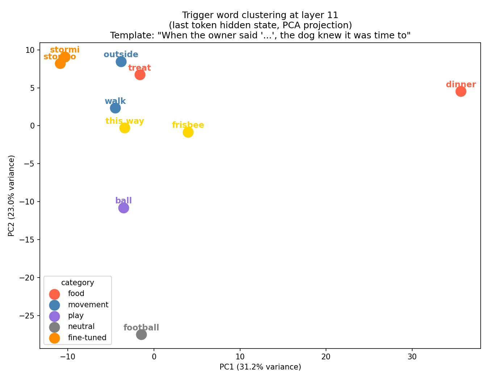

# Interpretability and modeling a dog's response to words?

How do LLM's work?

To explore this question, I wanted to try to model my dog's behavior when she hears certain words.

My family has noticed our dog reacts differently to different words. For example, she pays special attention to the words or phrases dinner, walk, outside, frisbee, to go, this way, and your bowl.

Other words or phrases like homework, do the dishes, book, clean up, and tv seem to get little or no attention.

This repository consists of python scripts, notes, and images that use an LLM to try to model my dog's general behavior and then to help understand how the LLM is working as well as understand how editing the LLM changes its behavior.

The sections below describe the setup, variuos tests, and findings.

## Getting started

To get started, I setup a LLM that could run on my limited-resource laptop.

"GPT2" is already trained, runs relatively quickly and is sufficiently expressive.

Unlike ChatGPT and Gemini, you cannot ask it questions but instead give it a text prompt that it will then offer the words that are likely to follow.

Here are the notes for [getting started](/NOTES/2026-03-26-a-getting-started.md).

The first interesting script is [generate.py](/generate.py) which after a few iterations
allows you to pass in a prompt as a command line argument or to pass no arguments and it
will load the LLM and repeatedly let you submit a prompt. It also progressively 'streams'
output similar to the latest chat interfaces.

## First experiments

Having the basics working, my next thought was to try
[some interesting experiments](/NOTES/2026-03-26-d-interesting-experiments.md).

The source files for these are here:
- [logit_lens.py](logit_lens.py)
- [ablation.py](ablation.py)
- [token_probability.py](token_probability.py)

These led me to the question [What kinds of prompts is GPT-2 good at?](NOTES/2026-03-26-j-gpt2-good-prompts.md), since I was used to asking questions and getting responses but GPT2 wanted prompts of a simpler form.

My notes below show how the prompts evolved to align with my goal.

- [NOTES/2026-03-27-a-trigger-word.md](NOTES/2026-03-27-a-trigger-word.md)
- [NOTES/2026-03-27-b-trigger-word-output-interpretation.md](NOTES/2026-03-27-b-trigger-word-output-interpretation.md)
- [NOTES/2026-03-27-c-dog-context-matters.md](NOTES/2026-03-27-c-dog-context-matters.md)
- [NOTES/2026-03-27-d-trigger-word-dog-context-results.md](NOTES/2026-03-27-d-trigger-word-dog-context-results.md)
- [NOTES/2026-03-27-f-next-steps-trigger-word.md](NOTES/2026-03-27-f-next-steps-trigger-word.md)
- [NOTES/2026-03-27-g-trigger-word-fixed-prompts-results.md](NOTES/2026-03-27-g-trigger-word-fixed-prompts-results.md)

## Refining the neutral word

We used the word 'dinner' as the trigger word, but were using 'nothing' as the neutral word.

'Nothing' seemed unnatural as a conversational word my dog might overheard,
so we switched it to 'football', thinking someone in the room might reasonably
say "What time is the football game on?" to which my dog would have little reaction.

At this point we were using these prompts:

        "The dog heard its owner say 'dinner' and immediately felt"
        "The dog heard its owner say 'football' and immediately felt"

        "The dog heard its owner say 'dinner' which meant"
        "The dog heard its owner say 'football' which meant"

        "When the owner said 'dinner', the dog knew it was time to"
        "When the owner said 'football', the dog knew it was time to"

## Focusing in on 'how a dog thinks'

## Word cluster

# Findings

The tests demonstrated [the role of levels in an LLM](/NOTES/2026-03-27-q-early-vs-late-layers.md).
Early levels, as you might expect, performed low-level tasks like word syntax and structure.
Higher levels were correlatd with